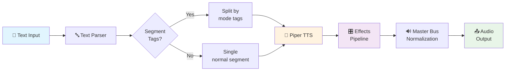
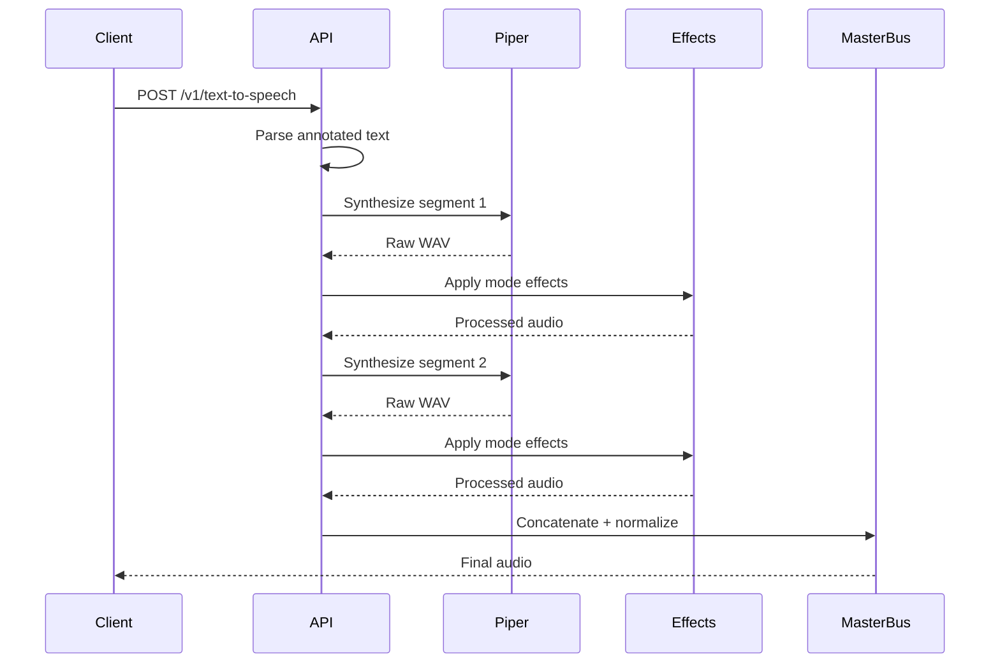

# LAPIS - Local API for Speech

A local TTS server using Piper neural text-to-speech engine with in-memory audio processing and customizable voice modes.

[](LICENSE)
[](https://www.python.org/)
[](https://fastapi.tiangolo.com/)

## Features

- **REST API** — Clean endpoints with annotated text support
- **In-memory processing** — Zero temporary files, everything in RAM
- **11 voice modes** — whisper, robotic, radio, breathy, and more
- **Per-voice configurations** — Unique parameters and effects per voice
- **Annotated text** — `<whisper>text</whisper>` style tags for segment modes
- **Web playground** — Interactive UI at `http://localhost:3000/`

## Quick Start

```bash
# Clone the repo
git clone https://github.com/fr4j4/lapis-tts.git
cd lapis-tts

# Install dependencies
./scripts/install.sh

# Download voice models (optional - only needed voices)
./scripts/install.sh --download-voices

# Start the server
./scripts/start.sh

# Generate speech
curl -X POST http://localhost:3000/v1/text-to-speech/lessac-en \
  -H "Content-Type: application/json" \
  -d '{"text": "Hello world"}' -o audio.wav
```

## Architecture



## Audio Processing Flow



## Included Voices

| Voice ID | Name | Language | Quality |
|----------|------|----------|---------|
| `lessac-en` | Lessac English | 🇺🇸 English | High |
| `amy-en` | Amy English | 🇺🇸 English | Medium |
| `ryan-en` | Ryan English | 🇺🇸 English | Medium |
| `claude-es` | Claude Spanish | 🇲🇽 Spanish (MX) | High |
| `ald-mx` | Ald Mexican | 🇲🇽 Spanish (MX) | Medium |
| `davefx-es` | DaveFX Narrator | 🇪🇸 Spanish (ES) | Medium |
| `mls-es` | MLS Spanish | 🇪🇸 Spanish (ES) | Low |

## Voice Modes

All voices support 11 modes for changing speech character mid-text:

```bash
curl -X POST http://localhost:3000/v1/text-to-speech/lessac-en \
  -H "Content-Type: application/json" \
  -d '{"text": "Normal text <whisper>whispered</whisper> <robotic>robotic voice</robotic>"}'
```

| Mode | Description |
|------|-------------|
| `normal` | Default voice |
| `whisper` | Realistic whisper |
| `breathy` | Breathed, intimate |
| `emphatic` | Emphasized clarity |
| `radio` | Intercom/radio effect |
| `processed` | Lab processing |
| `robotic` | Processed + radio |
| `menacing` | Threatening tone |
| `warm` | Cozy delivery |
| `dramatic` | Dramatic emphasis |
| `intimate` | Close, personal |

## Project Structure

```
lapis-tts/
├── voice-configs/          # Voice definitions
│   ├── lessac-en.json
│   └── ...
├── effects/                # Audio effect chains
│   ├── whisper.json
│   └── ...
├── voices/                 # ONNX voice models (downloaded)
├── src/
│   ├── main.py            # FastAPI entry point
│   ├── api/routes.py      # REST endpoints
│   ├── tts/engine.py      # Piper wrapper
│   └── effects/           # Audio processing
├── public/                 # Web playground
├── scripts/
│   ├── install.sh         # Setup + voice download
│   └── start.sh           # Launch server
└── tests/                 # Test suite
```

## Requirements

- **Python 3.9+**
- **ffmpeg** — `sudo apt install ffmpeg` or `brew install ffmpeg`
- **~500MB** disk space for voice models

## API Reference

### Endpoints

| Method | Endpoint | Description |
|--------|----------|-------------|
| `GET` | `/health` | Health check |
| `GET` | `/v1/voices` | List all voices |
| `GET` | `/v1/voices/{id}` | Voice details |
| `POST` | `/v1/text-to-speech/{id}` | Generate audio |

### Request Example

```json
{
  "text": "Hello <whisper>world</whisper>",
  "length_scale": 1.0,
  "noise_scale": 0.667
}
```

### Response

Returns audio binary with `Content-Disposition: attachment; filename="audio.wav"`

## LAPIS Integration

```json
{
  "plugins": {
    "entries": {
      "lapis-tts": {
        "enabled": true,
        "config": {
          "baseUrl": "http://localhost:3000",
          "voice": "lessac-en"
        }
      }
    }
  },
  "messages": {
    "tts": {
      "auto": "tagged",
      "provider": "lapis",
      "modelOverrides": {
        "enabled": true
      },
      "providers": {
        "lapis": {
          "enabled": true,
          "baseUrl": "http://localhost:3000",
          "voice": "lessac-en"
        }
      }
    }
  }
}
```

## License

MIT License - see [LICENSE](LICENSE)

## Voice Licenses

All included voices are MIT or Public Domain licensed. See [VOICES_LICENSE.md](VOICES_LICENSE.md) for details.

## Dependencies

| Package | License | Purpose |
|---------|---------|---------|
| Piper | MIT | TTS engine |
| FastAPI | MIT | Web framework |
| ffmpeg | LGPL | Audio effects |
| numpy | BSD | Audio processing |
